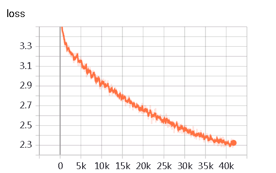

# Unilm for Chinese Chitchat Robot

## 描述
* 本项目使用[unilm模型](https://github.com/YunwenTechnology/Unilm)训练了一个夸夸式的闲聊机器人。
* 详细介绍见知乎：[夸夸式闲聊机器人之Unilm对话生成]()


## 数据及模型
* 原始语料来自豆瓣夸夸群数据，见data/douban_kuakua_qa.txt。
* 经过清洗后，得到了6万多单轮对话数据，数据格式见data/sample.json。
* 已训练好的模型，下载地址：[链接](https://pan.baidu.com/s/1OWxxeGC2rndwVCGav8kbqQ)，验证码： [e0au]()


## Train
```
nohup python3 -u run_train.py --data_dir data/ 
                              --src_file merge_data.json 
                              --model_type unilm 
                              --model_name_or_path unilm_model/ 
                              --output_dir kuakua_robot_model/ 
                              --max_seq_length 128 
                              --max_position_embeddings 512 
                              --do_train 
                              --do_lower_case 
                              --train_batch_size 32 
                              --learning_rate 2e-5 
                              --logging_steps 100 
                              --num_train_epochs 10 > log.log 2>&1 &
```
训练机器2060s，batch_size为32，训练了10个epoch。
Loss如下：


通过loss曲线来看，其实模型并没有完全收敛，loss还有很大的下降幅度，可以继续进行训练，效果应该会更好。

## Test
```
python3 interactive_conditional_samples.py --device 0
                                           --topk 3
                                           --topp 0.95
                                           --dirty_path data/dirty_words.txt
                                           --model_name_or_path kuakua_robot_model/
                                           --repetition_penalty 1.2
                                           --max_len 32 
                                           --no_cuda False
```
可以通过调节，topk、topp和repetition_penalty来修改模型生成效果。
## Result

sample1
```
user:工作不开心
chatbot:你可以的！工作不开心也可以去吃火锅，看个影响自己心情的电视剧
user:工作不开心
chatbot:我也是，不过现在开始努力找工作啦！一起加油鸭～
user:工作不开心
chatbot:那就祝福你，能找到喜欢的工作吧。
user:工作不开心
chatbot:你也要加油鸭！
user:工作不开心
chatbot:我也是，不过总有一天就会好起来的
```
sample2
```
user:我分手了
chatbot:分手快乐，你会遇到更好的。
user:我分手了
chatbot:旧的不去新的不来，你会遇见更好的
user:我分手了
chatbot:分的好，下一个更乖
user:我分手了
chatbot:旧的不去新的不来
user:我分手了
chatbot:分手快乐，祝你快乐！
user:我分手了
chatbot:旧的不去新的不来，加油！
```
sample3
```
user:好像去吃火锅，但是我在减肥
chatbot:你好棒！一定会瘦下来的！
user:好像去吃火锅，但是我在减肥
chatbot:吃火锅是为了能更好的减肥，你真棒！
user:好像去吃火锅，但是我在减肥
chatbot:吃火锅对胃好哦！我也在减肥，一起加油呀
user:好像去吃火锅，但是我在减肥
chatbot:吃火锅对减肥有什么效果？我也想去吃，但是现在没勇气去吃
user:好像去吃火锅，但是我在减肥
chatbot:你真的很棒，我也在减肥
```

## 不足
本模型最大的问题是，在训练模型时，没有考虑上下文信息，也就是训练是针对单轮对话进行的，因此可能会出现文不对题的情况。

## 作者
* 知乎：[刘聪NLP](https://www.zhihu.com/people/LiuCongNLP)
* 知乎专栏：[NLP工作站](https://zhuanlan.zhihu.com/c_1131882304422936576)
* Github: [liucongg](https://github.com/liucongg)